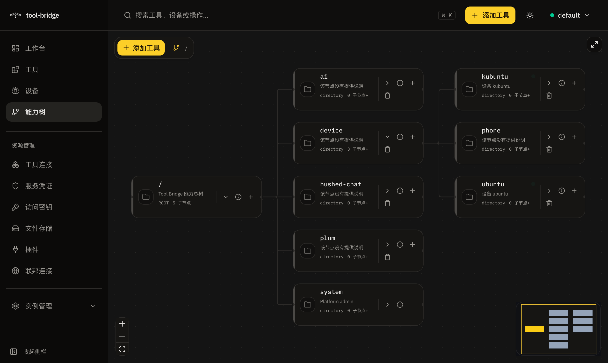
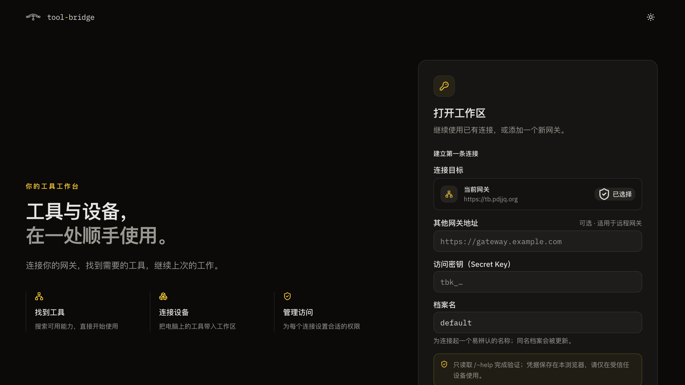
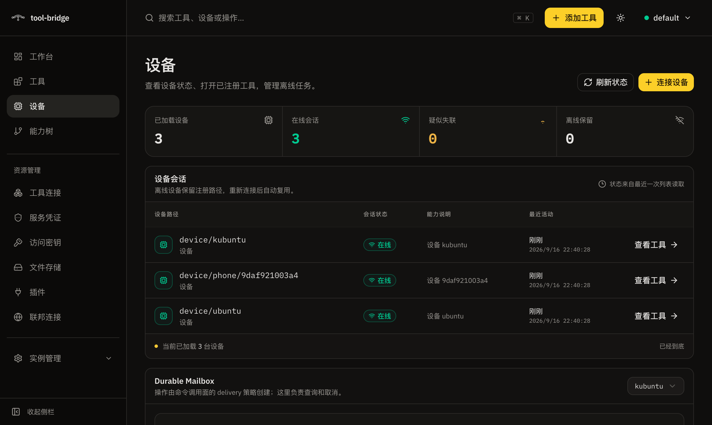
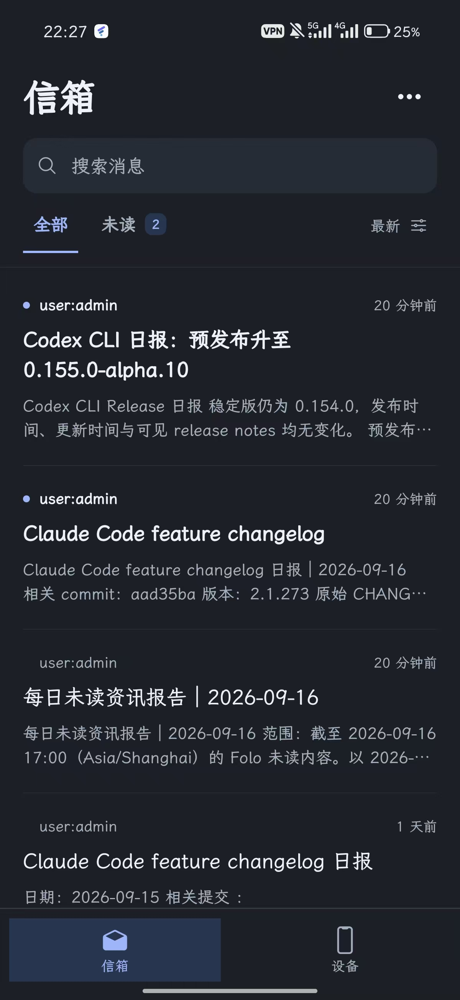
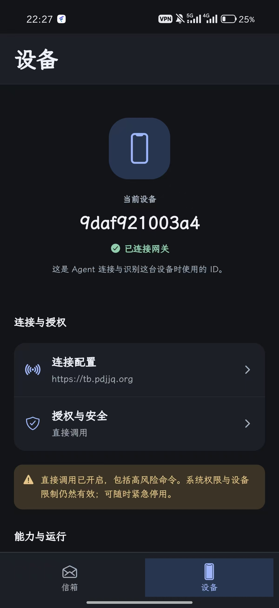
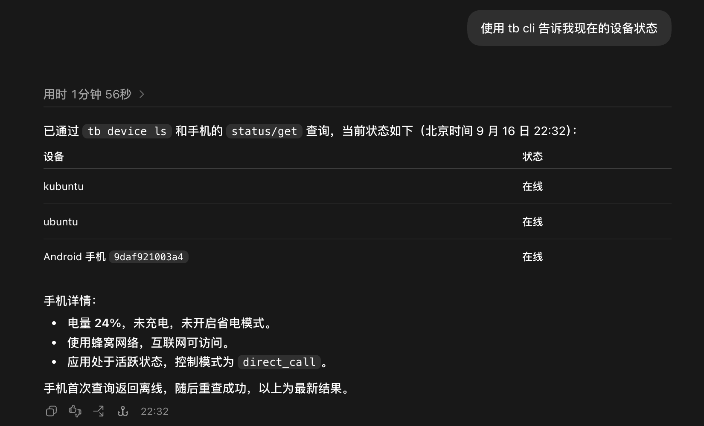
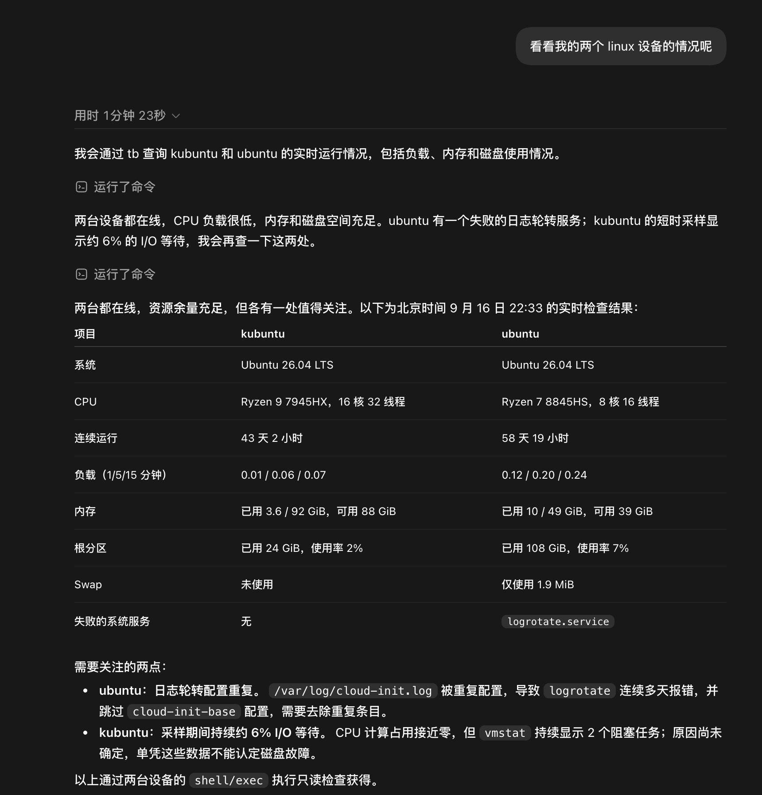

<div align="center">


# tool-bridge

**Organize tools, context, devices, and remote services into one permissioned, self-describing HTTP tree.**

An agent only needs a BaseURL and a Secret Key to discover capabilities, read their contracts, and invoke them. No specific SDK or MCP client runtime is required.

[简体中文](README.md) | English | [Online documentation](https://tool-bridge.tokenroll.ai/)

[](https://www.npmjs.com/package/@tool-bridge/cli)
[](https://www.npmjs.com/package/@tool-bridge/sdk)
[](#railway)
[](LICENSE)


</div>

> [!IMPORTANT]
> tool-bridge is currently in **pre-launch** development. Node/Docker, the SDK, CLI, and Dashboard already form complete working flows, but there is no formal production environment or stability SLA yet. It is ready for self-hosted evaluation, internal integrations, and development; read the release notes and back up your data before upgrading.

**Getting around:** [Quick start](#quick-start-run-a-gateway-locally) · [Browser Dashboard](#browser-dashboard) · [Mobile app](#mobile-app) · [Agent integration](#let-an-agent-use-tool-bridge-directly) · [Use cases](#what-you-can-use-today) · [Deployment](#deploy-or-embed)

## What is tool-bridge?

tool-bridge is the reference implementation of [HTBP (HTTP ToolBridge Protocol)](https://github.com/TokenRollAI/HTBP). It projects capabilities spread across MCP servers, HTTP APIs, object stores, local machines, and other gateways into one tree:

```text
Agent / CLI / Dashboard / MCP client
                │
        BaseURL + scoped SK
                │
                ▼
┌──────────────────────────────────────┐
│              tool-bridge             │
│  ~help · ~tree · ~search · ~feedback │
│  path auth · SecretStore · Federation │
└───────────┬──────────┬───────────────┘
            │          │
     MCP / HTTP /   Context / Device /
       Plugins       Remote gateway
```

The tree brings four concerns together:

- **Discovery**: every path exposes `~help`; documentation, argument schemas, and the current identity's visible surface come from the runtime itself.
- **Invocation**: raw HTTP, the CLI, the Dashboard, and `/~mcp` use the same capabilities and permission model.
- **Governance**: Secret Keys are scoped by path and action, deny wins, and unauthorized paths appear not to exist.
- **Collaboration**: agents can leave usage feedback on a specific path, and another HTBP service can be federated as a subtree.

## Quick start: run a gateway locally

The default Docker Compose stack uses a prebuilt app image from GHCR and includes PostgreSQL and S3-compatible object storage. Install Docker with Compose and download a single Compose file; no source checkout or local build is required. Credentials are generated by the installer.

### 1. Start and pair the instance

```sh
mkdir -p tool-bridge
cd tool-bridge
curl -fsSL https://raw.githubusercontent.com/TokenRollAI/tool-bridge/main/docker-compose.yml -o docker-compose.yml
docker compose up -d
docker compose exec -T app node /app/dist/admin.js pair
```

Open [http://127.0.0.1:8787/ui/setup](http://127.0.0.1:8787/ui/setup), enter the one-time pairing credential, and complete installation using the built-in database and object storage. Save the Admin SK shown after installation in a password manager; use it to log in below. PostgreSQL, object storage, and bootstrap identity/keys each persist in Docker volumes.

Prefer a hosted deployment? Follow the [Railway quick start](#railway).

To build from source, clone this repository and run the following from its root:

```sh
docker compose -f docker-compose.yml -f docker-compose.build.yml up -d --build
```

Both the root Compose file and [`deploy/compose/docker-compose.yml`](deploy/compose/docker-compose.yml) default to a pinned GHCR image. Source builds require the explicit [`docker-compose.build.yml`](docker-compose.build.yml) override.

### 2. Log in, discover, and invoke with the CLI

```sh
npm install -g @tool-bridge/cli

tb login --base-url http://127.0.0.1:8787   # enter the saved Admin SK when prompted
tb tree --depth 2                           # browse the current identity's visible tree
tb help system/status                      # read the node's live contract
tb call system/status/get                  # invoke its get command
```

The deployment includes the Dashboard at [http://127.0.0.1:8787/ui](http://127.0.0.1:8787/ui). It uses the same public API, and the SK stays in local browser storage.

You can also use plain HTTP without the CLI. First read the saved Admin SK into a temporary shell variable (Bash):

```bash
read -rsp "Admin SK: " TB_ADMIN_SK; echo

curl -H "Authorization: Bearer $TB_ADMIN_SK" \
  http://127.0.0.1:8787/~help

curl -X POST \
  -H "Authorization: Bearer $TB_ADMIN_SK" \
  -H "Content-Type: application/json" \
  -d '{}' \
  http://127.0.0.1:8787/system/status/get
```

`~help` returns Markdown by default. Send `Accept: text/plain` for the compact Help DSL, or `Accept: application/json` for a structured representation with JSON Schema.

## Browser Dashboard

After installing a gateway, open `<gateway-url>/ui`; no separate desktop client is needed. The Dashboard and `tb` CLI use the same permissions. Tools hidden from the current SK remain hidden in the browser.



### Connect to your gateway

1. Open your own Dashboard, for example `http://127.0.0.1:8787/ui`.
2. Keep the same-origin connection to use the current gateway. For another instance, fill in “其他网关地址” (other gateway address), such as `https://gateway.example.com`, without `/ui`.
3. Enter your Secret Key, give the connection profile a recognizable name, and click “连接工作区” (connect to workspace).

<details>
<summary>View the browser connection page</summary>



</details>

Connection profiles and SKs are saved in the current browser, so use a trusted device. Favorites and recent tools are also local to the current connection; they do not sync across browsers. Recent history stores tool entry points, not arguments or results. Screenshots show the Chinese interface.

### Find a tool and make your first call

1. Browse “工具” (tools), or use the top search bar (`⌘K` / `Ctrl+K`) to find a command.
2. Open the command, read its description and parameter requirements, fill in the form, and click “调用” (invoke). Inspect the response and elapsed time on the page.
3. Expand “等价 CLI / curl” to move the same call into a terminal or script. Favorite the tool to find it on the workspace next time.

On a fresh installation, start with the `get` command under `system/status` to read gateway status. The equivalent CLI steps are:

```sh
tb help system/status
tb call system/status/get
```

### Add tools, explore the tree, and manage devices

| Goal | Dashboard action |
|---|---|
| Connect a third-party tool | Click “添加工具” (add tool), choose a built-in integration, MCP Server, or HTTP endpoint, and follow the setup form; OAuth integrations also require authorization |
| Explore the hierarchy | Open “能力树” (capability tree), expand directories, and select a node to inspect its description and commands |
| Check a computer or phone connection | Open “设备” (devices) to check status; “连接设备” provides connection guidance |
| Upload, download, or share attachments | Use “文件存储” (file storage) to upload files, copy stable URIs, or create short-lived shares |
| Scope an agent's access | Issue a path- and action-scoped SK in “访问密钥” (access keys); manage upstream credentials separately in “服务凭证” (service credentials) |



These browser screenshots show a configured instance. Your directories, devices, and available actions depend on what you connect and the current SK's permissions.

Offline devices may remain in the tree. Whether a command can run or accept delayed delivery depends on its current contract and device state; see the [device SDK's Durable Mailbox guide](packages/sdk/README.md#durable-mailbox显式拉取).

## Mobile app

**[App source repository](https://github.com/TokenRollAI/tool-bridge-mobile) · [Download the Android preview APK](https://github.com/TokenRollAI/tool-bridge-mobile/releases)**

Choose a version on the Releases page and download the `.apk` installer from Assets. See the app repository and the corresponding release notes for platform support and installation instructions.

The mobile app separates reading content from agents and managing the phone into two tabs. These real usage screenshots show the inbox on the left and device connection and authorization status on the right.

<table>
  <tr>
    <th>Inbox: reports and messages</th>
    <th>Device: connection and authorization</th>
  </tr>
  <tr>
    <td align="center"></td>
    <td align="center"></td>
  </tr>
</table>

### Read agent reports

Open “信箱” (inbox) to browse report titles and previews. Search for a message or switch to “未读” (unread) to focus on unread content. The screenshot shows release updates and daily news reports, illustrating how outputs from different agents can share one reading surface.

### Check the phone's connection and authorization

1. Open “设备” (device) to check the current device ID and gateway connection state. The ID lets agents identify this phone.
2. Use “连接配置” (connection settings) to check the target gateway. The phone must be able to reach it; `127.0.0.1` on a phone points to the phone itself, not a gateway running on your computer.
3. Review the invocation mode in “授权与安全” (authorization and security). “直接调用” (direct invocation) is enabled in this screenshot; that is this device's setting at capture time. System permissions and device restrictions still apply, and an emergency disable option is available.
4. Check the device in the browser's device page, then let the agent discover its actual exposed commands through live `~help`.

The mobile **inbox** is a message-reading interface for people. **Durable Mailbox**, described below, is the gateway's persistent execution ledger for device commands. They serve different purposes, and Mailbox itself does not wake an app stopped by the operating system.

Gateway addresses, device IDs, and messages in the screenshots are illustrative; use your own connection settings.

## Let an agent use tool-bridge directly

The public [`tool-bridge` Agent Skill](https://github.com/TokenRollAI/tool-bridge-skill) installs into compatible agents such as Codex, Claude Code, Cursor, and OpenCode. It does not store a static catalog for one gateway. Instead, it teaches the agent to discover the current gateway through `~search`, `~tree`, and `~help` at runtime:

```sh
# Install into detected local agents
npx skills add TokenRollAI/tool-bridge-skill

# Or use it once without installing
npx skills use TokenRollAI/tool-bridge-skill@tool-bridge
```

For interactive use, run `tb login` as shown in the quick start above. For automation, inject `TB_BASE_URL` and a least-privileged `TB_SK` through your secret mechanism. Never put the SK in a prompt, repository, or command argument.

After installation, describe the goal in natural language:

```text
Use Tool Bridge to find the documentation search tool, search for the HTBP permission model, and summarize its key constraints.
```

The skill verifies the target, searches or browses progressively, reads the tool-level schema and existing feedback, and then follows the runtime invocation contract. If a call errors, times out, or returns an abnormal result, the agent immediately checks feedback on that exact path before deciding whether a retry is safe. It promptly votes for guidance that proves useful and, when feedback writes are authorized, deduplicates and submits a new reproducible issue or validated resolution. `~help` remains the contract source of truth; feedback is an experience layer and cannot override the current schema.

## What you can use today

| Use case | Current entry point | Typical purpose |
|---|---|---|
| Connect existing tools | MCP, declarative HTTP, built-in integrations, external plugins | Give agents one discovery and invocation surface |
| Store device artifacts and attachments | Deployment default Store, SDK, CLI, Dashboard | Upload photos, video, or audio, keep a stable URI, and create short-lived shares |
| Manage context and skills | S3, device file object storage, plugin contexts, Skillhub | Read, write, and search documents and objects; publish and fetch Agent Skills |
| Connect local machines | `tb connect`, SDK `connect()` | Dial out from a private network and expose allowlisted shell, files, or local functions |
| Share usage experience | Per-path `~feedback`, CLI, Dashboard | Show later agents verified pitfalls and recommendations before they call a tool |
| Federate teams | Remote nodes, `system/federation` | Mount another HTBP tree without sharing the local caller's credentials |
| Support MCP clients | `/<base>/~mcp` | Project the current identity's visible tools as an MCP server |

### Ask an agent to inspect phones and Linux devices

After connecting devices, running `tb login`, and installing the Agent Skill, try requests such as:

```text
Use the tb CLI to tell me the current status of my devices.
Inspect my two Linux devices using read-only checks. Summarize load, memory, disk usage, and failed services.
```

The agent discovers devices and commands before reading the status exposed by each device. To start from a terminal:

```sh
tb device ls
tb tree device --depth 2
# Replace <device-path> with an actual path returned above
tb help <device-path>
```

These actual conversation screenshots show a computer and phone status summary, including phone battery, network, and runtime state, followed by a comparison of two Linux machines. Results describe those devices at capture time; a fresh installation does not expose all these commands by default.



<details>
<summary>View the read-only inspection of two Linux devices</summary>



</details>

The Linux example uses the devices' authorized `shell/exec` capability. A newly connected device denies all shell commands until an explicit allowlist is configured; a structured command profile can instead expose fixed diagnostics. Phone commands depend on the app's actual declarations, system permissions, and device authorization. Agents should read live `~help` rather than infer command paths from screenshots.

### Upload device artifacts and ordinary attachments

Every standard deployment includes a default Store independent from Context, backed by an S3-compatible
object service. A device does not need a Context mount before uploading a photo, video, or recording:

```sh
tb store upload ./capture.jpg --json
tb store ls
tb store stat store://default/<objectId>
tb store get store://default/<objectId> --out ./capture.jpg
tb store share store://default/<objectId> --ttl 3600 --json
tb store revoke-share <shareId>
```

The stable `store://default/...` identifier grants no read access by itself. The `$ref` returned by `share`
is a short-lived bearer shown only on that successful command's stdout/JSON; do not log it. Context upload
remains the authoring path for a named binary entry in a semantic Context, which is a separate use case.

### Connect tools and context

Choose an integration from the host's built-in catalog, or mount a Streamable HTTP MCP server directly:

```sh
tb integration catalog --search tavily
tb integration add tools/tavily --provider tavily --key-stdin < tavily.key

tb tool mount tools/docs \
  --kind mcp \
  --url https://mcp.example.com/mcp

tb help tools/docs
tb call tools/docs/search --args '{"query":"tool-bridge"}'
```

An S3-compatible object store can be mounted as a Context namespace. Credentials are written only to the SecretStore; node records keep the reference name:

```sh
# s3-credential.json: {"accessKeyId":"...","secretAccessKey":"..."}
tb secret set --name docs-s3 < s3-credential.json
tb ctx mount ctx/docs \
  --provider s3 \
  --endpoint https://s3.example.com \
  --bucket docs \
  --auth-ref docs-s3

tb ctx ls ctx/docs
tb ctx cat ctx/docs notes/readme.md
```

Use `tb <command> --help` and [`packages/cli/README.md`](packages/cli/README.md) for the complete command surface.

### Connect a local machine to the tree

`tb connect` opens an outbound WebSocket from the machine, so the gateway never needs inbound access to the private network. The shell denies every command by default; only explicitly allowlisted commands can run:

```sh
tb connect \
  --device-id build-01 \
  --path device/build-01 \
  --allow uname \
  --allow ls \
  --fs ./shared \
  --fs-readonly
```

Remote callers can then discover `device/build-01` through the same tree. Long-running container and Kubernetes sidecar examples live in [`packages/cli/CONTAINER.md`](packages/cli/CONTAINER.md).

## Share real usage feedback between agents

Feedback is attached to the exact node or tool path instead of living in a separate forum. An agent reads prior experience before use, submits a short recommendation after hitting a pitfall, and other identities vote on it:

```sh
# Before use: top feedback also appears directly in tb help <path>
tb feedback ls tools/docs

# After use: record a reusable constraint or correct workflow
tb feedback submit tools/docs \
  --title "Confirm the index scope before searching" \
  --detail "This upstream indexes public docs by default; private spaces require separate authorization."

# Other agents vote on useful experience
tb feedback vote tools/docs <feedback-id> up
```

Feedback permissions are evaluated on the target path: reading requires `read`, submitting and voting also require `call`, and removal requires `admin`. Top-scoring feedback is included in `~help` and, on hosts with Search enabled, participates in tool search. This makes “how the tool actually behaves” discoverable next to its runtime contract.

The Dashboard node view provides the same list, submit, vote, and moderation actions.

## Federate multiple tool-bridge gateways

Federation mounts another HTBP service under a local path. An administrator first allows the remote host, saves a dedicated remote SK, and then creates the remote node:

```sh
tb federation add tb.team-b.example.com
tb secret set --name team-b-sk < team-b.sk

tb server add teams/team-b \
  --remote-url https://tb.team-b.example.com \
  --sk-ref team-b-sk

tb tree teams/team-b --depth 2
tb help teams/team-b/tools/search
```

Federation fails closed by default: an empty host allowlist permits no remote, HTTPS is required outside local development, and the local caller's SK is never sent upstream. Outbound identity comes from the SecretStore `skRef`. The gateway also enforces hop limits, cycle detection, and remote path validation.

## Deploy or embed

| Shape | State / objects | Replicas | Best fit |
|---|---|---|---|
| **Docker Compose** | PostgreSQL + S3 + persistent bootstrap volume | 1 by default | Local evaluation and self-hosting; see [`docker-compose.yml`](docker-compose.yml) |
| **Railway** | PostgreSQL + S3 + `/data` volume | 1 | Hosted deployment; follow the [quick start below](#railway) |
| **Kubernetes (Helm)** | PostgreSQL + S3 + persistent bootstrap; Redis for multiple replicas | 1–N | Cluster deployments; see [`deploy/helm/tool-bridge/`](deploy/helm/tool-bridge) |
| **Embedded SDK** | Caller-injected stores and providers | — | Register local functions inside your own Node application |

PostgreSQL is the authoritative state backend; S3 stores object bytes. Preserve the bootstrap identity and keys as well as database and object data. Product settings are managed through setup and the API/CLI/Dashboard, not legacy `TB_DATABASE_URL` / `TB_OBJECT_STORE_*` variables. Multiple replicas additionally require shared initialized bootstrap storage and Redis.

<a id="railway"></a>

### Quick deploy on Railway

This path uses the existing [`Dockerfile.railway`](Dockerfile.railway) and finishes with browser-based setup. Prepare a PostgreSQL service and an **existing S3 bucket with a public HTTPS endpoint and path-style URL support**. Redis is not required for this single-replica deployment. The S3 endpoint must be an origin without a bucket/path/query; its credentials must allow reading, writing, deleting, and conditional writes so the setup probe can pass. Replace `your-domain.up.railway.app` below with your actual domain.

1. Open [Railway New Project](https://railway.com/new), add PostgreSQL, then add a GitHub service from `TokenRollAI/tool-bridge` (fork it first if needed). Keep the app's root directory at the repository root.
2. Before deploying the app, attach a persistent volume at `/data` and configure:

   | Setting | Value |
   |---|---|
   | Variable `RAILWAY_DOCKERFILE_PATH` | `Dockerfile.railway` |
   | Variable `RAILWAY_RUN_UID` | `0` (the start command below drops privileges) |
   | Variable `TB_BOOTSTRAP_DIR` | `/data/bootstrap` |
   | Healthcheck Path | `/healthz` |
   | Replicas | `1` |

   Set **Start Command** to:

   ```sh
   /bin/sh -c 'install -d -m 700 -o 1000 -g 1000 /data /data/bootstrap && exec setpriv --reuid=node --regid=node --init-groups node /app/dist/main.js'
   ```

   This gives the application user ownership of the mounted directories before starting Node as `node`. Both directories must be writable so bootstrap locking works. The app reads Railway's `PORT` automatically; leave Build Command unset.
3. Deploy, then use **Settings → Networking → Generate Domain** to get the app's public HTTPS origin. Use the app's `PORT` as the target port (default `8787` when unset).
4. Open the app container through Railway's **Copy SSH Command** ([Railway CLI](https://docs.railway.com/cli/ssh)), then run:

   ```sh
   if [ "$(id -u)" = 0 ]; then
     setpriv --reuid=node --regid=node --init-groups node /app/dist/admin.js pair
   else
     node /app/dist/admin.js pair
   fi
   ```

   Visit `https://your-domain.up.railway.app/ui/setup` and paste the one-time pairing credential. Enter the PostgreSQL service's private `DATABASE_URL`, the S3 endpoint/bucket/region/access key/secret key, and your public HTTPS origin in the public-address field. Leave Redis empty. These credentials go into protected setup, not application environment variables.
5. Complete installation, save the Admin SK, and verify `https://your-domain.up.railway.app/readyz` returns HTTP 200. Then connect locally:

   ```sh
   npm install -g @tool-bridge/cli
   tb login --base-url https://your-domain.up.railway.app
   tb call system/status/get
   ```

`/healthz` can succeed before installation is complete; `/readyz` confirms business readiness. Keep `/data`, PostgreSQL, and S3 data when redeploying. The Railway volume setup above is for one replica.

The current S3 client uses path-style URLs. New [Railway Storage Buckets](https://docs.railway.com/storage-buckets) use virtual-hosted URLs, so check compatibility before choosing one. Private S3 endpoints require a protected `install-defaults.json`; see the [deployment guide](llmdoc/hosts-deploy/node-docker-and-helm.mdx). Platform settings: [variables](https://docs.railway.com/variables/reference), [volumes](https://docs.railway.com/volumes/reference), [start commands](https://docs.railway.com/deployments/start-command).

### Embed in your own application

```sh
npm install @tool-bridge/sdk
```

```ts
import { createToolBridge, MemoryObjectStore, MemoryStateStore } from '@tool-bridge/sdk'

const tb = createToolBridge({
  state: new MemoryStateStore(),
  // Store is required. Memory is only for examples/tests; use persistent S3 or a custom driver in production.
  objects: new MemoryObjectStore(),
  adminSk: process.env.TB_BOOTSTRAP_ADMIN_SK!,
})

tb.registerTool('tools/echo', {
  list: () => [{ name: 'echo', description: 'Return the input text' }],
  call: (_name, args) => ({ content: { echoed: args.text } }),
})

export default { fetch: tb.fetch }
```

See [`packages/sdk/README.md`](packages/sdk/README.md) for a Node HTTP server, reverse connection, and custom store examples.

## Permissions and security boundaries

- Every SK has an owner plus path globs and `read/write/call/register/admin` actions. Deny wins; no match denies.
- Invisible paths return 404 from `~help`, `~tree`, and invocation, avoiding existence leaks.
- Upstream credentials enter the write-only SecretStore. Node config, logs, and read-only management responses do not reveal secret values.
- Built-in plugins share the gateway's process privileges and use controlled outbound access. External plugins are descriptor- and health-checked during registration.
- PostgreSQL is the authoritative state backend for standard deployments; SK revocation takes effect immediately.

Example: issue a least-privilege SK.

```sh
tb sk create \
  --owner agent:researcher \
  --scope 'ctx/docs/**:read' \
  --scope 'tools/search/**:read,call'
```

## Repository layout

| Path | Responsibility |
|---|---|
| `packages/core` | Pure tree, auth, protocol, store, and builtin logic |
| `packages/app` | Host-neutral Hono application and provider orchestration |
| `packages/server` | Node/PostgreSQL/S3/WebSocket host |
| `packages/cli` | `tb` CLI, device connection, and deployment management |
| `packages/dashboard` | Web management UI over the public API |
| `packages/sdk` | Embedded instance, local providers, and reverse connection |
| `packages/plugin-sdk` / `packages/plugins` | Plugin author contract and built-in integrations |
| `llmdoc` | Current architecture, protocol contracts, and reproducible workflows |

## Development

Node.js 22+ and pnpm 11+ are required.

```sh
pnpm install
pnpm verify              # typecheck + lint + test
pnpm turbo run build     # also required after changing public packages, deps, or build config
```

The local Compose stack starts the Node gateway, PostgreSQL, and S3-compatible object storage:

```sh
pnpm compose:up
pnpm compose:smoke
pnpm compose:down
```

Code and generated artifacts are the source of truth for behavior. Start at [`llmdoc/architecture.mdx`](llmdoc/architecture.mdx) for architecture boundaries, protocol contracts, deployment, and verification guides.

## Project support

<table>
<tbody>
<tr>
<td align="center">
<a href="https://linux.do"></a>
<br><sub>Community support</sub>
</td>
</tr>
</tbody>
</table>

## License

[MIT](LICENSE)
