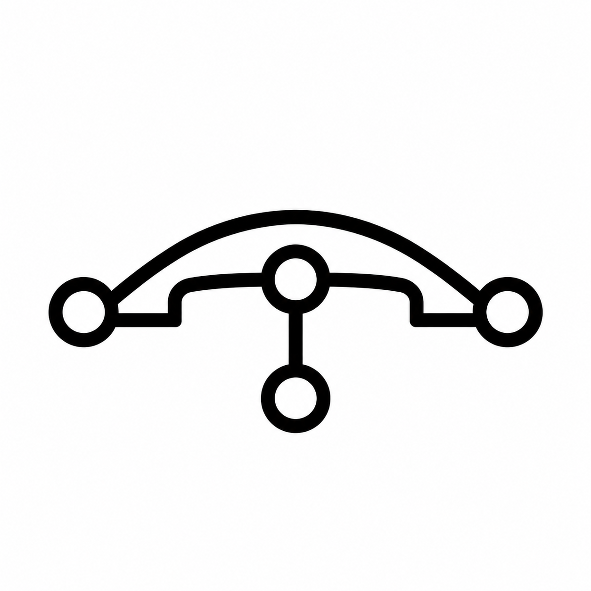

<div align="center">



# tool-bridge

**Organize tools, context, devices, and remote services into one permissioned, self-describing HTTP tree.**

An agent only needs a BaseURL and a Secret Key to discover capabilities, read their contracts, and invoke them. No specific SDK or MCP client runtime is required.

[简体中文](README.md) | English | [Online documentation](https://tool-bridge.tokenroll.ai/)

[](https://www.npmjs.com/package/@tool-bridge/cli)
[](https://www.npmjs.com/package/@tool-bridge/sdk)
[](LICENSE)

[](https://deploy.workers.cloudflare.com/?url=https://github.com/TokenRollAI/tool-bridge/tree/main/template)

</div>

> [!IMPORTANT]
> tool-bridge is currently in **pre-launch** development. Cloudflare, Node/Docker, the SDK, CLI, and Dashboard already form complete working flows, but there is no formal production environment or stability SLA yet. It is ready for self-hosted evaluation, internal integrations, and development; read the release notes and back up your data before upgrading.

## What is tool-bridge?

tool-bridge is the reference implementation of [HTBP (HTTP ToolBridge Protocol)](https://github.com/TokenRollAI/HTBP). It projects capabilities spread across MCP servers, HTTP APIs, object stores, local machines, and other gateways into one tree:

```text
Agent / CLI / Dashboard / MCP client
                │
        BaseURL + scoped SK
                │
                ▼
┌──────────────────────────────────────┐
│              tool-bridge             │
│  ~help · ~tree · ~search · ~feedback │
│  path auth · SecretStore · Federation │
└───────────┬──────────┬───────────────┘
            │          │
     MCP / HTTP /   Context / Device /
       Plugins       Remote gateway
```

The tree brings four concerns together:

- **Discovery**: every path exposes `~help`; documentation, argument schemas, and the current identity's visible surface come from the runtime itself.
- **Invocation**: raw HTTP, the CLI, the Dashboard, and `/~mcp` use the same capabilities and permission model.
- **Governance**: Secret Keys are scoped by path and action, deny wins, and unauthorized paths appear not to exist.
- **Collaboration**: agents can leave usage feedback on a specific path, and another HTBP service can be federated as a subtree.

## Quick start: run a gateway locally

This example uses the Node/Docker host. It stores state in SQLite and objects under `/data`, making it the shortest path to a local end-to-end setup.

### 1. Generate trust roots and start the server

Node.js 22+ is used below to generate two random values. Save the Admin SK: the gateway cannot reveal it later.

```sh
export TB_ADMIN_SK="$(node -e "console.log('tbk_'+require('crypto').randomBytes(32).toString('base64url'))")"
export TB_ENCRYPTION_KEY="$(node -e "console.log(require('crypto').randomBytes(32).toString('base64url'))")"

docker run -d --name tool-bridge \
  -p 127.0.0.1:8787:8787 \
  -v tool-bridge-data:/data \
  -e TB_BOOTSTRAP_ADMIN_SK="$TB_ADMIN_SK" \
  -e TB_SECRET_ENCRYPTION_KEY="$TB_ENCRYPTION_KEY" \
  ghcr.io/tokenrollai/tool-bridge:latest
```

In production, inject both values through your platform's secret mechanism. Do not bake them into an image, repository, or shared script.

### 2. Log in, discover, and invoke with the CLI

```sh
npm install -g @tool-bridge/cli

tb login --base-url http://127.0.0.1:8787   # enter the saved Admin SK when prompted
tb tree --depth 2                           # browse the current identity's visible tree
tb help system/status                      # read the node's live contract
tb call system/status --tool get           # invoke its get command
```

The deployment includes the Dashboard at [http://127.0.0.1:8787/ui](http://127.0.0.1:8787/ui). It uses the same public API, and the SK stays in local browser storage.

You can also use plain fetch without the CLI:

```sh
curl -H "Authorization: Bearer $TB_ADMIN_SK" \
  http://127.0.0.1:8787/~help

curl -X POST \
  -H "Authorization: Bearer $TB_ADMIN_SK" \
  -H "Content-Type: application/json" \
  -d '{"tool":"get","arguments":{}}' \
  http://127.0.0.1:8787/system/status
```

`~help` returns Markdown by default. Send `Accept: text/plain` for the compact Help DSL, or `Accept: application/json` for a structured representation with JSON Schema.

## Let an agent use tool-bridge directly

The public [`tool-bridge` Agent Skill](https://github.com/TokenRollAI/tool-bridge-skill) installs into compatible agents such as Codex, Claude Code, Cursor, and OpenCode. It does not store a static catalog for one gateway. Instead, it teaches the agent to discover the current gateway through `~search`, `~tree`, and `~help` at runtime:

```sh
# Install into detected local agents
npx skills add TokenRollAI/tool-bridge-skill

# Or use it once without installing
npx skills use TokenRollAI/tool-bridge-skill@tool-bridge
```

For interactive use, run `tb login` as shown in the quick start above. For automation, inject `TB_BASE_URL` and a least-privileged `TB_SK` through your secret mechanism. Never put the SK in a prompt, repository, or command argument.

After installation, describe the goal in natural language:

```text
Use Tool Bridge to find the documentation search tool, search for the HTBP permission model, and summarize its key constraints.
```

The skill verifies the target, searches or browses progressively, reads the tool-level schema and existing feedback, and then follows the runtime invocation contract. If a call errors, times out, or returns an abnormal result, the agent immediately checks feedback on that exact path before deciding whether a retry is safe. It promptly votes for guidance that proves useful and, when feedback writes are authorized, deduplicates and submits a new reproducible issue or validated resolution. `~help` remains the contract source of truth; feedback is an experience layer and cannot override the current schema.

## What you can use today

| Use case | Current entry point | Typical purpose |
|---|---|---|
| Connect existing tools | MCP, declarative HTTP, built-in integrations, external plugins | Give agents one discovery and invocation surface |
| Manage context and skills | R2, S3, Node file object storage, plugin contexts, Skillhub | Read, write, and search documents and objects; publish and fetch Agent Skills |
| Connect local machines | `tb connect`, SDK `connect()` | Dial out from a private network and expose allowlisted shell, files, or local functions |
| Share usage experience | Per-path `~feedback`, CLI, Dashboard | Show later agents verified pitfalls and recommendations before they call a tool |
| Federate teams | Remote nodes, `system/federation` | Mount another HTBP tree without sharing the local caller's credentials |
| Support MCP clients | `/<base>/~mcp` | Project the current identity's visible tools as an MCP server |

### Connect tools and context

Choose an integration from the host's built-in catalog, or mount a Streamable HTTP MCP server directly:

```sh
tb integration catalog --search tavily
tb integration add tools/tavily --provider tavily --key-stdin < tavily.key

tb tool mount tools/docs \
  --kind mcp \
  --url https://mcp.example.com/mcp

tb help tools/docs
tb call tools/docs --tool search --args '{"query":"tool-bridge"}'
```

An S3-compatible object store can be mounted as a Context namespace. Credentials are written only to the SecretStore; node records keep the reference name:

```sh
# s3-credential.json: {"accessKeyId":"...","secretAccessKey":"..."}
tb secret set --name docs-s3 < s3-credential.json
tb ctx mount ctx/docs \
  --provider s3 \
  --endpoint https://s3.example.com \
  --bucket docs \
  --auth-ref docs-s3

tb ctx ls ctx/docs
tb ctx cat ctx/docs notes/readme.md
```

Use `tb <command> --help` and [`packages/cli/README.md`](packages/cli/README.md) for the complete command surface.

### Connect a local machine to the tree

`tb connect` opens an outbound WebSocket from the machine, so the gateway never needs inbound access to the private network. The shell denies every command by default; only explicitly allowlisted commands can run:

```sh
tb connect \
  --device-id build-01 \
  --path device/build-01 \
  --allow uname \
  --allow ls \
  --fs ./shared \
  --fs-readonly
```

Remote callers can then discover `device/build-01` through the same tree. Long-running container and Kubernetes sidecar examples live in [`packages/cli/CONTAINER.md`](packages/cli/CONTAINER.md).

## Share real usage feedback between agents

Feedback is attached to the exact node or tool path instead of living in a separate forum. An agent reads prior experience before use, submits a short recommendation after hitting a pitfall, and other identities vote on it:

```sh
# Before use: top feedback also appears directly in tb help <path>
tb feedback ls tools/docs

# After use: record a reusable constraint or correct workflow
tb feedback submit tools/docs \
  --title "Confirm the index scope before searching" \
  --detail "This upstream indexes public docs by default; private spaces require separate authorization."

# Other agents vote on useful experience
tb feedback vote tools/docs <feedback-id> up
```

Feedback permissions are evaluated on the target path: reading requires `read`, submitting and voting also require `call`, and removal requires `admin`. Top-scoring feedback is included in `~help` and, on hosts with Search enabled, participates in tool search. This makes “how the tool actually behaves” discoverable next to its runtime contract.

The Dashboard node view provides the same list, submit, vote, and moderation actions.

## Federate multiple tool-bridge gateways

Federation mounts another HTBP service under a local path. An administrator first allows the remote host, saves a dedicated remote SK, and then creates the remote node:

```sh
tb federation add tb.team-b.example.com
tb secret set --name team-b-sk < team-b.sk

tb server add teams/team-b \
  --remote-url https://tb.team-b.example.com \
  --sk-ref team-b-sk

tb tree teams/team-b --depth 2
tb help teams/team-b/tools/search
```

Federation fails closed by default: an empty host allowlist permits no remote, HTTPS is required outside local development, and the local caller's SK is never sent upstream. Outbound identity comes from the SecretStore `skRef`. The gateway also enforces hop limits, cycle detection, and remote path validation.

## Deploy or embed

| Shape | State / objects / devices | Replicas | Best fit |
|---|---|---|---|
| **Docker (single container)** | SQLite + local filesystem + in-process WebSocket | 1 | Self-hosting, private networks, quick evaluation |
| **Docker Compose** | PostgreSQL (+ optional S3/R2, Redis) | 1–2 (one machine) | Single-machine production, incl. an HA reference stack — see [`deploy/compose/`](deploy/compose/docker-compose.yml) |
| **Kubernetes (Helm)** | PostgreSQL + S3/R2 + Redis → stateless multi-replica; or SQLite + PVC single replica | 1–N | Multi-replica production with rolling updates — see [`deploy/helm/tool-bridge/`](deploy/helm/tool-bridge) |
| **Cloudflare Workers** | KV + R2 + D1 + Durable Objects | serverless | Edge deployment, low operations, long-lived device connections |
| **Embedded SDK** | Caller-injected stores and providers | — | Register local functions inside your own Node/Workers application |

Horizontal scaling formula for the Node host: **PostgreSQL (`TB_DATABASE_URL`) + S3/R2 (`TB_OBJECT_STORE_*`) + Redis (`TB_REDIS_URL`) together make it a stateless multi-replica deployment**; with only the first two it is a single-replica stateless shape (containers can be recreated freely, but do not scale out). The Helm chart rejects dangerous combinations (such as `replicas>1 + SQLite`) at render time. Health probes: `/livez` (liveness), `/readyz` (readiness: backend connectivity plus early traffic removal during graceful shutdown), `/healthz` (version and catalog digest).

### Cloudflare Workers

The fastest entry point is the Deploy Button at the top of this page. Generate and save `TB_BOOTSTRAP_ADMIN_SK` and `TB_SECRET_ENCRYPTION_KEY` first. The template requests both before the first build so a gateway is never started without its trust roots. See [`template/README.md`](template/README.md) for the complete flow.

For a full deployment from a source checkout, use the CLI wizard:

```sh
git clone https://github.com/TokenRollAI/tool-bridge
cd tool-bridge
pnpm install
npm install -g @tool-bridge/cli

tb init cloudflare --repo .
```

The wizard logs into and selects an account, generates trust roots, provisions KV/R2/D1, builds and deploys, verifies `~help`, and saves a local profile. Use `--account-id <id> --yes` in non-interactive environments and `--domain tb.example.com` for a custom domain.

### Embed in your own application

```sh
npm install @tool-bridge/sdk
```

```ts
import { createToolBridge, MemoryStateStore } from '@tool-bridge/sdk'

const tb = createToolBridge({
  state: new MemoryStateStore(),
  adminSk: process.env.TB_BOOTSTRAP_ADMIN_SK!,
})

tb.registerTool('tools/echo', {
  List: () => [{ name: 'echo', description: 'Return the input text' }],
  Call: (_name, args) => ({ content: { echoed: args.text } }),
})

export default { fetch: tb.fetch }
```

See [`packages/sdk/README.md`](packages/sdk/README.md) for a Node HTTP server, reverse connection, and custom store examples.

## Permissions and security boundaries

- Every SK has an owner plus path globs and `read/write/call/register/admin` actions. Deny wins; no match denies.
- Invisible paths return 404 from `~help`, `~tree`, and invocation, avoiding existence leaks.
- Upstream credentials enter the write-only SecretStore. Node config, logs, and read-only management responses do not reveal secret values.
- Built-in plugins share the gateway's process privileges and use controlled outbound access. External plugins are descriptor- and health-checked during registration.
- Workers KV has eventual-consistency windows for revocation and registry reads. Prefer the Node/SQLite host when state must be strongly consistent.

Example: issue a least-privilege SK.

```sh
tb sk create \
  --owner agent:researcher \
  --scope 'ctx/docs/**:read' \
  --scope 'tools/search/**:read,call'
```

## Repository layout

| Path | Responsibility |
|---|---|
| `packages/core` | Pure tree, auth, protocol, store, and builtin logic |
| `packages/app` | Host-neutral Hono application and provider orchestration |
| `packages/server` | Node/SQLite/filesystem/WebSocket host |
| `packages/gateway` | Cloudflare KV/R2/D1/DO/Assets host |
| `packages/cli` | `tb` CLI, device connection, and Cloudflare initialization |
| `packages/dashboard` | Web management UI over the public API |
| `packages/sdk` | Embedded instance, local providers, and reverse connection |
| `packages/plugin-sdk` / `packages/plugins` | Plugin author contract and built-in integrations |
| `llmdoc` | Current architecture, protocol contracts, and reproducible workflows |

## Development

Node.js 22+ and pnpm 11+ are required.

```sh
pnpm install
pnpm verify              # typecheck + lint + test
pnpm turbo run build     # also required after changing public packages, deps, or build config
```

The local Compose flow starts the Node gateway, a real plugin Worker, and an authenticated mock MCP upstream:

```sh
pnpm compose:up
pnpm compose:smoke
pnpm compose:down
```

Code and generated artifacts are the source of truth for behavior. Start at [`llmdoc/index.md`](llmdoc/index.md) for architecture boundaries, protocol contracts, deployment, and verification guides.

## License

[MIT](LICENSE)
