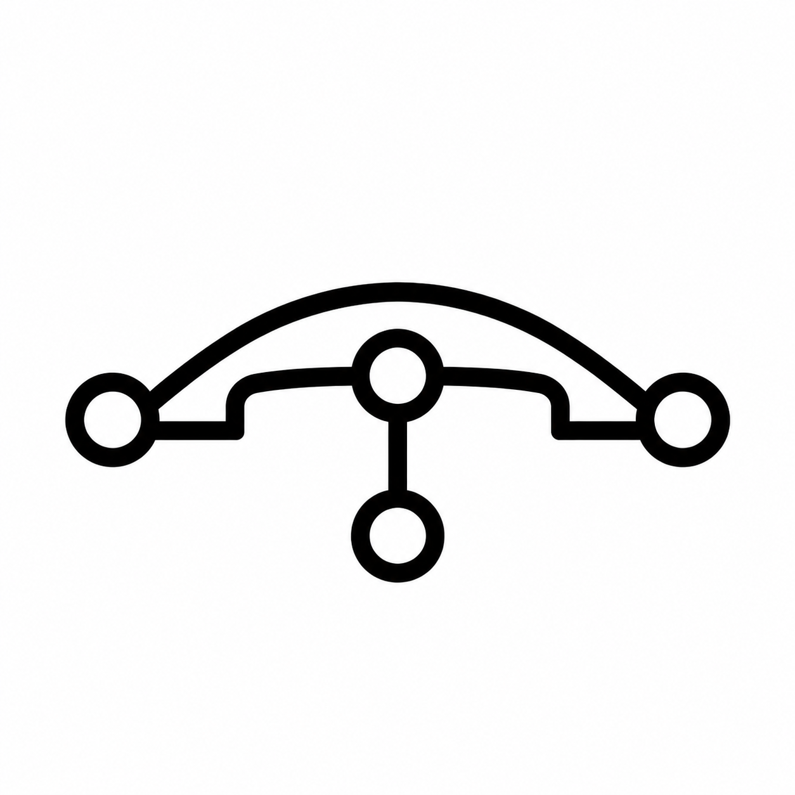

<div align="center">



# tool-bridge

**自描述、可反向注册、协议开放的工具与上下文网关**

任何会 HTTP fetch 的 Agent,凭一个 Secret Key + 一个 BaseURL,即可发现并使用一个组织的全部工具、上下文与设备。

简体中文 | [English](README.en.md)

[](https://www.npmjs.com/package/@tool-bridge/cli)
[](https://www.npmjs.com/package/@tool-bridge/sdk)
[](LICENSE)

[](https://deploy.workers.cloudflare.com/?url=https://github.com/TokenRollAI/tool-bridge/tree/main/template)

</div>

---

tool-bridge 是 [HTBP](https://github.com/TokenRollAI/HTBP)(HTTP ToolBridge Protocol)的参考实现。核心理念:**能 fetch URL,就能学会用对应的工具**。

<div align="center">
<table><tr><td>

```
┌──────────────────────────────────────────────────────┐
│  任意 Agent / CLI / Dashboard(只需 SK + BaseURL)     │  ← GET /~help 渐进发现
├──────────────────────────────────────────────────────┤
│                    tool-bridge                        │
│   HTBP Tree · Tool Layer · Context Layer              │
│   Device Gateway(反向注册) · Auth(SK 作用域)       │
├──────────────────────────────────────────────────────┤
│  上游:MCP server(Streamable HTTP) · HTTP API       │
│  来源:R2 / S3 / File / 自定义 Provider(Plugin)     │
│  设备:任何跑得动 CLI/SDK 的机器(WebSocket 反向接入) │
└──────────────────────────────────────────────────────┘
```

</td></tr></table>
</div>

## 它解决什么问题

让 Agent 用上"组织里已有的能力"(工具、文档、机器),今天必须逐个打通:

1. **工具接入受限于运行环境**——边缘函数、浏览器、受限 sandbox 里跑不了 MCP client;
2. **上下文碎片化**——知识散落在 R2/S3、文件系统、内部系统里,没有统一读写检索面;
3. **机器能力够不着**——内网服务器的 shell 与文件系统对云上 Agent 完全不可见;
4. **发现即文档**——每接一个工具就要写一份说明,说明与实现总是漂移;
5. **权限缺失**——一把 key 要么全能要么不能,缺少"只能读 `docs/`、只能调 `search/`"的表达。

tool-bridge 把这五件事收敛为**一棵自描述的树**:所有能力(工具、Context、设备、联邦服务)都是树上节点;树上每一级路径都响应 `~help`,`~help` 即文档、即契约、即按权限裁剪后的可见面;每个 Secret Key 有明确作用域,无权节点对调用者根本不存在。

## 能力总览

| 能力 | 说明 |
|---|---|
| **HTBP 树与渐进发现** | 根 `/~help` 出发逐级下钻;`~tree?depth=N` 受限深度总览;`~help` 默认返回面向 LLM 的紧凑 Help DSL(`text/plain`),声明 `Accept: application/json` 得到语义等价的 JSON(含真 JSON Schema,可直接渲染表单) |
| **工具层** | 挂载 MCP server(Streamable HTTP,官方 SDK 会话复用)、任意 HTTP API(声明式 HttpToolDef);**工具虚拟化**(前缀 / 重命名 / 隐藏 / 描述覆盖),对外只暴露虚拟名 |
| **remote 联邦** | 把另一个 HTBP 服务挂成子树,`~help`/`~tree`/调用透传;https 强制 + host 白名单 + `X-TB-Via` 环检测;本地调用者 SK 不外传,出站凭证经 `skRef` 换发 |
| **Context 层** | R2 / S3 挂成 namespace,统一 `List/Get/Update/Write` 四动词 + `Search`;乐观并发(`ifVersion`);>1 MiB 大对象返回 `$ref` 预签名 URL(无凭证时走网关中转),不占网关流量 |
| **Skillhub 层** | 把 Agent Skill(`SKILL.md` + 文本文件的目录)发布到树上、任意 Agent 凭 fetch 发现并取用:`List/Get/Search/Publish/Remove`;存平台自带 R2 **无需外部凭证**,服务端解析 `SKILL.md` frontmatter 成 name/description 目录(`tb skill get --out` 直接拉到本地 `.claude/skills/`) |
| **设备反向注册** | 内网机器 `tb connect` 主动建立 WebSocket,把自己的 shell 与 fs 挂上树;shell 默认拒绝一切命令、白名单放行;断线返回 503 retryable,重连自愈;云侧用 Durable Object WebSocket Hibernation,空闲近零计费 |
| **SK 权限模型** | 每个 Secret Key = owner + 作用域列表(路径 glob × 动作集,deny 优先、无匹配默认拒);**可见性即权限**:无权节点在 `~help`/`~tree` 中不存在(404 而非 403);吊销全球传播 ≤60s(实测 0.3s) |
| **凭证托管** | 上游 AK/SK 经 SecretStore 加密存储(AES-256-GCM,只写不读),节点配置只存引用名,凭证不出网关、不出现在任何 `~help`/返回值 |
| **Plugin 系统** | 第三方以 HTTP 服务形态实现 Tool/Context Provider,注册即探活 + 契约校验,与内置 Provider 地位对等 |
| **SDK** | 在自己的 Node 进程里内嵌一个 TB 实例,注册本地函数为工具,还可反向 `connect` 到远程网关——本地函数出现在远程树上 |
| **三入口对等** | Agent(直接 HTTP)、CLI(`tb`,全命令 `--json`)、Dashboard 对同一棵树行为一致,不存在管理旁路 |

## 使用方式

### Agent 视角:只需 fetch

不需要任何 SDK——这正是设计目标:

```sh
# 从根开始渐进发现(~help 返回面向 LLM 的紧凑 Help DSL)
curl -H "Authorization: Bearer $TB_SK" https://your-tb.example.com/~help

# 下钻某个节点,看它有哪些工具、怎么调
curl -H "Authorization: Bearer $TB_SK" https://your-tb.example.com/tools/search/~help

# 调用工具
curl -X POST -H "Authorization: Bearer $TB_SK" \
  -d '{"tool":"query","arguments":{"q":"hello"}}' \
  https://your-tb.example.com/tools/search

# 读一个 context 条目
curl -X POST -H "Authorization: Bearer $TB_SK" \
  -d '{"tool":"Get","arguments":{"path":"notes/readme.md"}}' \
  https://your-tb.example.com/ctx/docs
```

### CLI:`tb`

```sh
npm install -g @tool-bridge/cli
```

```sh
tb login                                    # 交互保存 BaseURL + SK(多 profile)
tb status --json                            # 网关健康摘要
tb tree --depth 3                           # 树视图
tb help tools/search                        # 任意节点的 ~help

# ── 挂载工具 ──────────────────────────────────────────
tb tool mount tools/docs --kind mcp --url https://mcp.example.com/mcp
tb tool mount tools/echo --kind http --endpoint https://postman-echo.com \
  --tools-file ./echo-tools.json
tb tool mount tools/notion --kind tool --provider notion-tools --auth-ref notion-token
tb call tools/echo --tool get --args '{"foo":"bar"}'

# ── 挂载 Context ─────────────────────────────────────
tb secret set --name s3-cred                         # 凭证从 stdin 进 SecretStore,只写不读
tb ctx mount ctx/docs --provider s3 --endpoint https://... --bucket docs --auth-ref s3-cred
tb ctx put ctx/docs notes/hello.md --content '# hi'
tb ctx cat ctx/docs notes/hello.md
tb ctx search ctx/docs hi
tb ctx rm ctx/docs notes/hello.md

# ── 反向注册本机 ─────────────────────────────────────
tb connect --allow 'echo' --allow 'uname' --fs ~/shared   # 长驻;shell 白名单 + fs 暴露
tb device ls                                              # 另一终端:看设备在线状态
tb call device/<id>/shell --tool exec --args '{"command":"echo hi"}'

# ── 联邦另一个 HTBP 服务 ─────────────────────────────
tb server add fed/team-b --remote-url https://tb.team-b.example.com --sk-ref team-b-sk

# ── 权限管理 ─────────────────────────────────────────
tb sk create --owner agent:reader --scope 'ctx/docs/**:read' --scope 'tools/search:call'
tb sk list --limit 50
tb sk get <id> && tb sk disable <id> && tb sk enable <id>
tb sk update <id> --expires 2026-12-31T23:59:59Z
tb sk rm <id>

# ── Plugin ───────────────────────────────────────────
tb plugin register --file ./manifest.json && tb plugin health my-plugin
```

21 个顶层命令共享全局参数位置语义：`--json` / `--base-url` / `--sk` / `--timeout`
可放在根命令、命令组或叶子命令位置（长驻 `connect` / `mount fs` 不适用 timeout，会明确
报错）；返回 `Page` 的列表/搜索命令统一支持 `--limit 1..200` 与 `--cursor`。CLI 是纯
API 客户端，没有任何专用端点。

### Dashboard

部署后访问 `https://your-tb.example.com/ui`,输入 SK + BaseURL:

- 树导航 + 任意节点的表单调用(`~help` 的 JSON Schema 自动渲染表单)+ markdown 返回值展示;
- context 条目浏览(List 钻取 / Search / Get 预览 / Write 编辑);
- SK 签发与吊销、Registry 管理、设备在线状态、凭证管理;
- ⌘K 命令面板全树模糊跳转。

Dashboard 无专用后端——它只是 `~help` 的通用渲染器,SK 只存浏览器本地。

### SDK:内嵌一个 TB 实例

```sh
npm install @tool-bridge/sdk
```

```ts
import { serve } from '@hono/node-server'
import { createToolBridge, MemoryStateStore } from '@tool-bridge/sdk'

const tb = createToolBridge({ state: new MemoryStateStore() })

// 把本地函数注册为树上的工具
tb.registerTool('tools/echo', {
  List: () => [{ name: 'echo', description: '原样返回 text' }],
  Get: () => ({ name: 'echo' }),
  Call: (_name, args) => ({ content: { echoed: args.text } }),
})

// 作为独立 HTBP 服务对外
serve({ fetch: (req) => tb.fetch(req), port: 8787 })

// 或者:反向连接到远程网关——本地函数工具出现在远程树上
const conn = await tb.connect('https://your-tb.example.com', process.env.TB_SK!)
await conn.ready
```

详见 [packages/sdk/README.md](packages/sdk/README.md)。

## 部署

### Cloudflare(默认路径,空闲近零成本)

运行形态:单 Worker(API + Dashboard 一体)+ KV(树配置/SK)+ R2(context/大对象)+ 每设备一个 Durable Object(WS hibernation)。

```sh
git clone https://github.com/TokenRollAI/tool-bridge && cd tool-bridge
pnpm install

# 1. 配置:填 CLOUDFLARE_ACCOUNT_ID / TB_DOMAIN / TB_BASE_URL,
#    并生成 TB_SECRET_ENCRYPTION_KEY(模板内有生成命令)
cp .env.example .env

# 2. 本地验证(typecheck + lint + 单测 + 真实 workerd 集成测试)
pnpm verify

# 3. 注入生产 secrets(Admin SK 明文 + SecretStore 主密钥)
cd packages/gateway
npx wrangler secret put TB_BOOTSTRAP_ADMIN_SK
npx wrangler secret put TB_SECRET_ENCRYPTION_KEY
cd ../..

# 4. 部署:幂等创建 KV/R2 → 构建 Dashboard → 部署 gateway
pnpm deploy:all

# 5. 冒烟验证
TB_BASE_URL=https://your-tb.example.com TB_SK=... pnpm smoke
tb login && tb status --json
```

首次运行时网关自动完成引导:物化 `system/*` 管理子树(sk / secret / registry / status / plugin),生成 Admin SK(scope 为全树全动作,用于签发更细粒度的 SK;明文仅输出一次)。

本地开发:`pnpm gen-dev-vars`(从 .env 生成 .dev.vars)后 `npx wrangler dev`。

### Docker(自部署,路线图)

同一套核心经 Node 宿主(SQLite + 本地 FS)以单容器运行、`/data` 卷持久化——宿主中立装配面(SDK 同款)已就绪,镜像在路线图中。也可以现在就用 SDK + `@hono/node-server` 自行拉起一个 Node 实例(见上文 SDK 一节)。

## 仓库结构(pnpm monorepo)

| 包 | 职责 |
|---|---|
| `packages/core` | 纯逻辑内核:树 / Auth(SK 作用域判定)/ HTBP 编解码 / Context·Device·Plugin 纯逻辑 / SecretStore / builtin 模块,无宿主依赖 |
| `packages/gateway` | Cloudflare Workers 网关:Hono 路由 + mcp/http/remote/plugin/r2/s3 Provider + Durable Object 设备通道 + Dashboard 静态托管 |
| `packages/cli` | `tb` 命令行(citty),纯 API 客户端 — npm 包 [`@tool-bridge/cli`](https://www.npmjs.com/package/@tool-bridge/cli) |
| `packages/sdk` | npm 包 [`@tool-bridge/sdk`](https://www.npmjs.com/package/@tool-bridge/sdk):内嵌 TB 实例、程序化注册、反向连接 |
| `packages/dashboard` | Web 管理面:`~help` 通用渲染器 + 管理表单,无专用后端 |
| `llmdoc/` | 项目知识库(架构边界、协议契约、生产坑、工作流) |
| `archive/` | bootstrap 期规范与过程文档归档(仅历史追溯) |

## 开发

```sh
pnpm verify              # 一把过:typecheck + lint + 全部测试
pnpm test:unit           # core / cli / sdk 单测
pnpm test:integration    # gateway 集成测试(真实 workerd)
pnpm lint:fix            # biome 自动修复
```

工程约定:**代码是行为真源**;接口契约、模块边界与生产坑的查表文档在 [llmdoc/](llmdoc/index.md)(契约入口:`llmdoc/reference/protocol-contract.md`)。

## 项目状态

积极开发中(pre-release)。核心能力已全部落地并在 Cloudflare 生产环境验证:SK 鉴权与作用域、HTBP 树与内容协商、工具层(mcp / http / remote 联邦 + 虚拟化)、Context 四动词 + `$ref` 大对象、设备反向注册(WebSocket hibernation)、SDK 与 Plugin 系统、Dashboard;`@tool-bridge/cli` 与 `@tool-bridge/sdk` 已发布 npm。路线图:`tb init` 一键部署向导、Docker 自部署路径、七个 User Case 的端到端验收系统化。

## License

[MIT](LICENSE)
