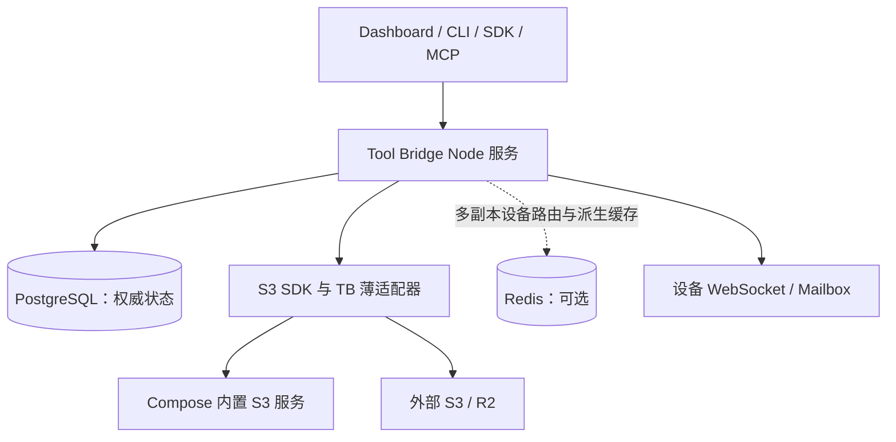

# Tool Bridge：Self-hosted 架构重构方案与实施路线

日期：2026-09-05。

状态：**设计与实施计划，尚未完成实现迁移。** 文中的目标接口、命令与部署形态均为拟议设计；当前行为以代码和 llmdoc 的现状说明为准。

本文承接 [开源组件替代审计](./open-source-replacement-audit.md)，更新其中的部署前提与优先级，不沿用历史行数或删码估算作为本轮承诺。目标是减少长期维护的实现与部署分支，同时保留 Tool Bridge 的权限、工具发现和设备执行语义。

## 1. 决策状态与重构目标

| 事项 | 状态 | 本轮结论 |
| --- | --- | --- |
| Self-hosted 优先 | 已确认 | 本地与自行部署是长期主线，完整 Docker Compose 是首要交付方式 |
| Cloudflare 优先级 | 已确认 | Workers 原生部署降为次级适配，平台限制不再决定主线的存储抽象 |
| SQLite | 已确认可以移除 | 从 Node 服务的生产/开发运行后端及公开导出中移除，不再维持 PG/SQLite 全功能对等 |
| PostgreSQL | 本方案目标 | 成为标准服务的唯一权威数据库；充分使用事务、约束和索引 |
| 对象存储 | 用户认可的探索方向 | 用 S3 兼容服务替换部署级本地文件对象后端，支持 self-hosted S3 与外部 R2 |
| Dashboard 配置 R2 | 用户认可的探索方向 | 纳入实施范围；必须同时提供 API、CLI，并解决旧对象与在途上传的后端绑定 |
| Redis | 本方案建议 | Compose 提供可选组件，先保留设备跨副本路由，缓存只用于可重建数据 |
| 默认 S3 服务品牌 | 待兼容性原型决定 | 不直接锁定已归档的 MinIO 社区镜像；先评估 SeaweedFS，AIStor 为另一个可选方案 |
| 联邦搜索一致性 | 待产品决策 | 可以研究精简，但本轮不把“允许分页重复或失效规则放宽”当作已接受变更 |

成功标准不是依赖更多、文件更少，而是：一次业务修改涉及更少权威定义；数据一致性由成熟组件承担；默认部署无需云账号；没有为次级宿主长期维护另一套核心业务状态机。

## 2. 当前问题与替换边界

| 当前实现 | 造成的成本 | 目标处理 |
| --- | --- | --- |
| SQL 后端仍通过 `StateStore` 的 JSON KV + 单键 CAS 暴露 | Store 多记录写入要补偿，owner 列表先扫描再过滤，Mailbox 扫历史找待办 | 配置保留简单 KV；Store/Mailbox 使用窄领域存储接口和 PG 表 |
| Node 缺数据库配置时回退 SQLite | 双驱动、双搜索适配、原生依赖和双套部署验收 | PG 必填，缺失时给出部署错误，不创建新的本地库 |
| 部署级 FS ObjectStore | 临时文件、fsync、硬链接、rename、staging 清理及路径防护都由仓库承担 | 删除运行时 FS fallback，字节操作交给 S3 服务 |
| `aws4fetch` 上手写 S3 REST/XML | XML 解码、分页、路径编码、响应及异常处理自行维护 | Node 使用官方 AWS S3 SDK，保留小型 TB 语义适配器 |
| 一个进程固定一个 ObjectStore | 改 endpoint 会让旧对象和在途上传找错桶 | 对象绑定不可变后端身份，切换只改变新上传的默认后端 |
| 固定端点在 app/OpenAPI/SDK 重复绑定 | 路径、schema 与返回值可能漂移 | 少量固定路由先验证声明与生成方案 |
| 手写 OAuth URL 与静态资源协议 | 已复现 query 拼接和编码协商边界错误 | Web 标准 API、OAuth 库与 Hono 中间件 |
| 递归联邦搜索的严格快照 | 递归校验、会话账本、全局配额及清理成本 | 保留现有契约，另开有真实查询样本的精简试点 |

代码入口：[`StateStore`](../packages/core/src/store.ts)、[`StoreService`](../packages/core/src/objectStoreService/service.ts)、[`Mailbox`](../packages/core/src/device/mailbox.ts)、[`Node FS driver`](../packages/server/src/objects.ts)、[`S3 driver`](../packages/app/src/providers/s3Object.ts)、[`Node 装配`](../packages/server/src/server.ts)。

### 2.1 三种“CAS/原子写”必须分开处理

1. **业务元数据 CAS**：object/session/quota/lease 的并发状态转换。迁到 PG 事务与条件更新，仍需防止两个消费者同时推进状态。
2. **对象字节的条件写**：禁止覆盖、按 ETag 更新。交给经过验证的 S3 `If-None-Match` / `If-Match`，不能退化成先 HEAD 再 PUT。
3. **设备本地执行屏障**：设备 journal 的 fsync/rename 用于崩溃恢复、防止未知结果被重新执行。它不属于网关对象存储，不迁到远端 S3。

`packages/server/src/objects.ts` 是可退役的部署级对象后端。`packages/core/src/node/fsObjectStore.ts` 仍服务设备暴露本地目录，设备执行 journal 也仍需本地持久化，不能按文件名机械删除。设备本地目录 `ifMatch` 的并发语义应另行审计，不在本轮冒充已获得 S3 的原子保证。

## 3. 目标运行架构

应用保持一个服务进程和现有 core/app/server 的责任划分，不拆微服务。PG、S3 和 Redis 是成熟基础设施；只有出现明确扩展需要时才把后台 maintenance 独立成进程。

- **PG**：节点、SK、加密凭证、配置、Store 元数据、Mailbox、必要持久任务与审计记录。
- **S3 服务**：对象字节、对象级条件写和必要的上传原语。Tool Bridge 仍决定 owner、分享、限额与对象何时可读。
- **Redis**：设备连接路由、瞬时通知、经评估的派生缓存；不是权限、执行结果或存储记录的唯一来源。
- **浏览器和 neutral SDK**：继续通过公开 HTTP 契约访问，不能因服务端改成 PG/S3 SDK 而引入 Node 依赖。

CF 作为云厂商与 Workers 作为应用宿主是两件事。Node 自托管连接 R2 S3 API，符合本方案；无需 CF Workers、D1 或 Durable Objects。

## 4. PG 主线与 SQLite 退役

### 4.1 移除范围

删除 Node 的 SQLite StateStore/SearchIndex、默认回退分支、`better-sqlite3` 相关运行依赖、公开导出和只服务该后端的测试/构建配置。根开发 Compose、生产 Compose、示例、Helm 与安装说明统一指向 PG。

SDK 当前的内存测试替身和设备本地 journal 不等于 SQLite；它们不在删除范围。SDK 嵌入应用如要持久 Store/Mailbox，应显式注入新的领域依赖，不能通过不具原子性的默认实现伪装生产可用。

**升级后的行为变化**：不设置数据库连接的服务将不能启动；旧 SQLite 类导出不再存在。该变化必须在 minor 版本、提交、PR 与迁移说明中明确写出。

### 4.2 持久层形状

保留现有 `postgres` 驱动。优先以 Drizzle 做 schema、迁移和查询原型，但只有净收益成立才引入；不再造通用 ORM、事务 DSL 或全后端兼容层。

建议用两个领域接口包住真正的业务原子操作，而非把 `transaction(callback)` 暴露给所有 core 代码：

| 接口/操作（示意名） | 应由一次数据库原子操作保护的内容 |
| --- | --- |
| `StoreRepository.beginUpload` | 幂等绑定、对象记录、上传会话、call 配额 reservation、backendId |
| `StoreRepository.finishUpload` | 确认当前 session、推进 ready、固定已消耗配额；成功不能释放 call 的累计对象名额 |
| `StoreRepository.listReadyObjects` | owner/status 过滤与稳定分页 |
| `MailboxRepository.enqueue` | 幂等键唯一性、pending 配额与 operation 创建 |
| `MailboxRepository.claimNext` | device/credential 约束、候选选择、lease/attempt 推进 |
| `MailboxRepository.complete` | 有效 lease、终态幂等提交与结果持久化 |

表至少覆盖 objects、upload sessions、shares、call reservations、device operations、storage backends 与当前默认配置。简单配置仍可存在 PG JSONB KV 中，不为“关系化完整”重写所有 registry/secret 读写。

配额迁移保持既有累计语义：成功上传继续消耗该 call 的对象数/字节额度，不能因 session 完成而允许同一次 call 无限上传。未知 size 的预留差额是否返还、失败/取消何时释放，逐项按旧实现对拍；改变这些行为需单独声明契约变化。

索引围绕真实访问建立：owner + status + 分页键、device + 可领取状态/时间、到期清理时间、幂等身份。并发测试必须验证配额判定与写入处于同一原子边界；`SKIP LOCKED` 只解决候选领取，不自动解决配额和副作用幂等。[PG 领取语义](https://www.postgresql.org/docs/current/sql-select.html)

### 4.3 不跨网络持有数据库事务

上传授权、S3 PUT/HEAD/DELETE 和 PG 提交分段完成，不能持有行锁等待远端网络：

1. PG 创建有界 reservation 和 pending/session。
2. 返回 relay/direct 授权，执行对象存储 I/O。
3. 服务端校验实际对象后，用 PG 事务推进 ready。
4. 断线或崩溃留给同 identity 的恢复/清理流程，不产生新 identity 重做外部副作用。

对象已上传而 PG 未提交、PG 标记删除而 S3 暂时不可达，这两种情况仍需可恢复状态。迁移的目标是删除跨数据库记录的人工补偿，不是声称数据库和 S3 构成一个分布式事务。

## 5. S3 对象存储与默认服务选型

### 5.1 MinIO 的当前状态改变了默认选择

2026-09-05 核查：[MinIO 社区仓库](https://github.com/minio/minio)明确已归档且不再维护。官方转向 AIStor；其[容器安装](https://docs.min.io/aistor/installation/container/install/)要求许可证，包含可申请的单机免费层。因此，“默认部署旧 MinIO 社区镜像”不应直接成为长期方案。

| 候选 | 定位 | 决策条件 |
| --- | --- | --- |
| SeaweedFS | 默认本地 S3 服务的首个原型候选 | 官方已有单机 S3/Docker 入口；需验证条件写、流式上传、重启持久性、资源占用及最小暴露面 |
| MinIO AIStor | 用户自选的 S3 后端候选 | 接受其当前许可与获取流程后验证；不把自动接受许可或申请账号藏进安装脚本 |
| 现有 MinIO 部署 | 兼容接入候选 | 针对部署版本测试；不因此承诺维护旧上游软件 |
| R2 / AWS S3 | 用户配置的外部对象后端 | 分别通过所需 S3 能力测试，不将“S3 兼容”理解为全部行为相同 |

SeaweedFS 的[官方项目](https://github.com/seaweedfs/seaweedfs)提供 S3 Docker/单机运行方式。这只是进入原型的依据，不构成生产可靠性或 TB 契约等价的验收结论。最终镜像必须在实施 PR 中锁定版本/摘要。

### 5.2 用官方 SDK 接管协议

Node 优先试用 `@aws-sdk/client-s3` 与 `@aws-sdk/s3-request-presigner`，替换手写 S3 URL/XML/分页/签名调用编排；R2 官方直接提供这套 SDK 的[接入示例](https://developers.cloudflare.com/r2/examples/aws/aws-sdk-js-v3/)。

保留薄适配层负责：TBError 映射、secret 脱敏、域与网络策略、请求 deadline、流式限额、create-only/ETag 契约和 backendId 选择。SDK 留在 Node 服务端边界，不能进入浏览器或 neutral device SDK 闭包。

原型明确配置 `maxAttempts: 1`，先保住当前不隐式重放请求的行为；未来重试按操作幂等性单独决定。AWS 将 initial request 计入 max attempts，1 表示无自动重试。[重试配置](https://docs.aws.amazon.com/sdkref/latest/guide/feature-retry-behavior.html)

还需验证 SDK 的流式 body、socket 释放、checksum 默认行为与 R2 兼容性，不用 `arrayBuffer()` 把大对象全部读进内存。[SDK 流处理](https://docs.aws.amazon.com/sdk-for-javascript/v3/developer-guide/migrate-s3.html)

### 5.3 必需能力与可选直传

服务端 relay 的必需能力是 PUT/HEAD/GET/DELETE、metadata、create-only 条件写；Context 还要验证 LIST、分页、特殊字符 key、ETag 条件更新和保留 namespace 隔离。S3 的条件写用于对象原子保护。[AWS 条件写](https://docs.aws.amazon.com/AmazonS3/latest/userguide/conditional-writes.html)

后端不满足所需原子条件时拒绝启用相关能力，不能用 HEAD+PUT 模拟。R2 逐项对照[兼容表](https://developers.cloudflare.com/r2/api/s3/api/)，不能凭 SDK 调用成功推导所有条件都被服务端执行。

**默认本地 S3 先走 gateway relay**：Compose 内部域名无法被用户浏览器/设备访问，HTTPS Dashboard 也不能直接访问内网 HTTP 地址。后端 signer 可用不等于 direct 可用。

直传必须同时验证：

- 公网可达且符合信任策略的 S3 endpoint；禁止签名后改 host/scheme。
- 精确 size 与 Content-Length、Content-Type、create-only 条件实际受签名及后端约束；错误大小被拒绝。
- 浏览器 CORS、真实 PUT、complete/HEAD 构成闭环；浏览器不能手工设置某些受限 header，必须测试最终 wire。
- 上传会话的大小/数量限制、TTL 和 secret 脱敏保持一致。

不满足直传条件时使用受限流式 relay，而不是放宽大小和条件写保证。R2 presigned URL 需要使用 S3 API 域，不能任意替换成自定义域名。[R2 presigned URL](https://developers.cloudflare.com/r2/api/s3/presigned-urls/)

下载先保留现有网关鉴权 relay 与可撤销 share。直接签发长寿命 S3 GET 会改变撤销语义，不纳入本轮默认优化。Multipart/断点续传按真实文件需求单独验证 SDK/lib-storage/tus，不提前扩成通用上传平台。

## 6. Dashboard 配置 R2 与存储后端管理

### 6.1 最小用户流程

在管理区增加“对象存储”配置，与已有文件列表区分：

1. 展示当前默认后端、历史仍有数据的后端、健康/验证结果。
2. 新增连接：选择 R2 或通用 S3，填写 endpoint、bucket、region 和凭证。R2 可以提供 account ID 的便捷输入以生成标准 endpoint。
3. 保存为未启用配置；输入凭证只写 SecretStore，后续页面仅显示“已配置”，留空表示沿用。
4. 管理员显式执行“测试读写”，服务端在专用随机 probe key 上做 PUT/HEAD/GET/DELETE，并实测 create-only 并发冲突；如服务 Context，还需实测 If-Match、LIST/分页等所需能力。显示逐项结果及清理失败，不扫描业务对象或要求列出账户全部 bucket。
5. 对应配置 revision 与 credential generation 的全部必需能力通过后，执行“用于新上传”；普通读写成功不足以启用。说明旧文件继续保留在原存储，不把切换按钮描述成数据搬迁。
6. 有引用的旧后端可停用新上传，但不可删除；凭证轮换走独立更新和复验流程。

第一阶段只连接已存在的 R2 bucket，不索取 Cloudflare 账户级管理 token，也不默认替用户创建桶/更改 CORS。若后续增加云资源创建，单独定义最小授权范围与失败补偿。

### 6.2 权威配置与凭证

PG 保存 `backendId`、显示名称、endpoint、bucket、region、prefix、authRef、revision 和验证能力；访问密钥通过现有 SecretStore 加密保存。原始密钥不进入 backend GET、registry、审计、浏览器持久状态或 CLI argv。

配置创建时，把用户授权提供/引用的凭证保存为内部受保护的 credential generation；复用现有保留命名空间，不让普通 `secret set/delete` 绕过存储验证改写它。验证结果绑定 backend revision 和 credential generation。轮换先验证新凭证，再原子切换 generation；失败保持旧值，请求期间固定 generation，旧值按在途请求与恢复窗口回收。

部署仍需从环境/secret 文件提供 PG 连接、加密根、bootstrap 身份和基础网络策略。Dashboard 不能修改这些启动信任根。

Compose 初次初始化创建一个默认 S3 backend 和应用专用 bucket 凭证。已有 PG 配置时不在每次启动用 env 覆盖它；环境变量是首次初始化输入，数据库配置是此后唯一运行时权威。迁移旧 `TB_OBJECT_STORE_*` 配置时显式生成初始 backend 记录并保留审计证据。

配置管理使用独立的部署级 admin 权限；普通节点 `register`/`read`/`call` 不能修改默认桶或使用任意 secret。解析 authRef 前验证 secret 使用权限；错误不暴露密钥存在性。

### 6.3 网络与 SSRF 边界

S3 endpoint 变为 UI 输入后，服务端必须在 probe、启用和所有实际请求上执行同一策略：标准 URL parser、拒绝 userinfo/query/fragment/未知路径形态、限制 scheme、禁止 redirect 重放凭证、设置 deadline 与响应大小上限。

Compose 的私网 S3 是精确的部署级例外：允许声明的服务 origin 和必要 HTTP，不通过全局开关放开全部 provider 的内网访问。Metadata/link-local 等地址继续拒绝。Node 的 DNS 检查必须与实际连接绑定，或由部署网络出口保证；仅在保存表单时解析一次域名不能宣称已阻断 DNS rebinding。优先复用成熟 request handler/网络策略组件，不手写另一套 DNS 协议。

应用凭证仅需目标 bucket/prefix 的业务权限，存储 root/admin 凭证只用于初始化，不进入 Tool Bridge 日常请求配置。

### 6.4 三入口对等

下列名称是**拟议接口**，不是当前可执行命令：

| 管理能力 | HTBP/API 建议 | CLI 建议 | Dashboard |
| --- | --- | --- | --- |
| 查询后端 | `system/storage list|get` | `tb storage list|get` | 列表与详情 |
| 创建配置 | `system/storage write` | `tb storage add` | 新增连接 |
| 轮换凭证 | `system/storage update` + SecretStore | `tb storage update` + stdin/file 凭证通道 | 留空沿用、显式替换 |
| 验证能力 | `system/storage test` | `tb storage test` | 测试读写 |
| 切换新上传 | `system/storage activate` | `tb storage activate` | 用于新上传 |
| 删除无引用后端 | `system/storage delete` | `tb storage rm` | 删除 |

沿用现有 HtbpCommandRegistry/Zod 投影 Help、权限和入参，不新增另一条绕过 HTBP 的管理通道。`system/store` 继续管理用户对象；`system/storage` 管理部署后端。实现时同步 builtin 保留路径、SDK、MCP 可见性与三端发现闭环。

### 6.5 切换不丢旧对象

当前 StoreObject 只有 driverKey，服务实例只有一个 ObjectStore，因此**先实现 backendId，再开放切换 UI**：

- backend 的 endpoint/bucket/prefix 定义不可原地改变；更换位置创建新 backendId。凭证轮换保留 backendId，提升配置 revision。
- 每个 object 持有唯一权威 backendId；upload session、share 优先通过 objectId 解析后端，不重复存储可漂移的字段。幂等重试恢复原绑定。
- `activate` 原子修改唯一 active backend 指针；新建上传在创建事务中读取该指针。不能依赖 Redis 消息才能看见切换。
- 旧 session 的 PUT、complete、HEAD，以及旧对象的 read/share/delete/cleanup 均按原 backendId 路由；请求期间固定 driver/config revision。
- share 通过 object 解析后端，公开 `store://default/<id>` 身份不变。
- 旧 backend 尚被对象、会话或待清理记录引用时不得删除；旧 secret 也不能被删除后让这些记录不可恢复。

首版支持“一处用于新上传、多处保存历史对象”，不提供按用户分桶、自动分层或通用多云调度。切回旧默认只改变后续新上传，新后端已有对象仍从新后端读取；旧后端故障不能静默读取其他桶的同名 key。

现有对象型 Context 也可能复用平台 ObjectStore。切换 default Store 时，既有 Context 必须显式绑定原 backend 或使用其自身独立配置，不能随 active 指针一起换桶。迁移时核对 Context 和 Store 两类引用，继续隔离保留 namespace；删除历史后端的引用检查也必须包含 Context。

## 7. 其他代码收敛与明确保留项

| 工作 | 做法 | 验收重点 |
| --- | --- | --- |
| OAuth URL | 用 URL/URLSearchParams；标准 provider OAuth 试 oauth4webapi，MCP 继续官方 SDK | 已有 query 不产生重复协议参数；fragment 拒绝；PKCE/refresh/凭证绑定与跳转策略不退化 |
| 静态文件 | Hono static/ETag + 构建预压缩 | `*;q=1, br;q=0, gzip;q=0` 不发 br；304/Vary、SPA fallback 与路径防护 |
| 挂载参数 | 共享 normalized input → NodeConfig 的 Zod 规则 | CLI/UI 不再平行维护 MCP OAuth 与 HTTP tool shape |
| 固定 API | 用三个 device operation 端点试 @hono/zod-openapi 与生成 client | route/schema/OpenAPI 一处声明；runtime validation 与错误脱敏保留 |
| Provider catalog | 挑几个维护成本最高的 provider 比较官方 SDK/OpenAPI 生成 | 普通 HTTP 已有共享层，不重复实施历史审计的已完成工作 |
| 搜索 | 先保留 PG 查询；另试 Meilisearch 或放宽联邦快照 | 中文/英文真实 query 的 top-k、权限、延迟、运维成本；不能只比行数 |
| 包与构建 | 统一 source resolution，按真实消费者决定 public 包边界 | neutral 闭包、tarball 和跨 bundle TBError 行为不破坏 |

保留的产品核心：HTBP 树/动态发现、deny 优先与不可见 404、SecretStore 引用边界、受控出站、设备连接 generation、Mailbox dispatch certainty/journal、Store owner/capability/share、Context 与 Store namespace 隔离。

Self-hosted 默认闭环不依赖 SaaS。Nango/OpenConnector 等独立集成服务仅作为另行评估的可选项；不因它们有大量连接器就直接转移凭证权威或取消现有 provider 安全边界。

## 8. Compose 交付、维护与故障行为

目标基础栈：应用（含 Dashboard）+ PG + 本地 S3 服务。Redis 在多副本 profile 启用；外部 S3/R2 模式不启动本地对象服务。默认使用一个应用副本，避免把多副本本身当成可靠性的前提。

完整交付至少包括：

- 明确的配置模板、密钥生成方法、固定镜像版本/摘要和健康检查。
- PG/S3 持久卷；应用容器不再持有权威对象字节。数据库和对象服务管理端口默认不暴露公网。
- 一次性 bucket/应用凭证初始化，以及受数据库锁保护的 schema migration；失败时新服务不接受业务流量。
- readiness 等待实际依赖就绪，应用运行期支持连接重建；容器 `unhealthy` 不等于 Docker 自动重启或故障转移。[Compose 启动语义](https://docs.docker.com/compose/how-tos/startup-order/)
- PG 备份、对象备份、加密根备份与恢复演练；只有数据库 dump 无法恢复对象，只有 bucket 无法恢复 owner/分享/凭证。
- 升级前备份、明确 schema 兼容窗口和失败恢复；单机双副本不能掩盖宿主机、PG 或对象盘单点。

| 故障 | 目标行为 |
| --- | --- |
| PG 不可用 | 依赖权威状态的请求失败，readiness 不就绪；不使用缓存继续接受授权写入 |
| S3 暂时不可用 | Store 请求可诊断失败；已知状态保留，恢复后继续同 session/清理；不宣告对象 ready |
| Redis 不可用 | 单副本不受该依赖约束；多副本路由按明确未知/未分发结果处理，不盲目重执行 |
| 新后端验证失败 | 配置保持未启用，不改变 active backend |
| 切换后旧 S3 不可用 | 只影响绑定旧后端的对象，显示可诊断失败；不跨桶猜测对象 |
| maintenance 中途崩溃 | 可从持久记录继续；重复 tick 不越过状态和删除权限边界 |

## 9. 数据迁移、兼容与 Cloudflare 处理

### 9.1 新部署与旧数据分开

新部署直接使用 PG + S3。旧预览环境可由部署者选择重建，但不能默认删除已有数据。需保留数据的实例走一次性维护窗口迁移，不做双写平台。

迁移顺序：

1. 停止新写入、设备 claim 与后台 cleanup；在途上传完成或显式收敛，保留未知执行结果。
2. 备份旧 SQLite/PG KV、对象目录/桶、加密根和部署配置；记录可恢复的完整源快照。
3. 用独立迁移工具读取旧 SQLite/PG KV，导入 PG 目标表；保留 owner、SK 身份、时间、幂等键和密文关联字段，不无理由旋转加密根。
4. 原来就在 S3 的对象绑定原 S3 backend。原 FS 对象先复制到目标 S3，逐对象计算并核对源/目标 SHA-256 与大小，再在切流前把对象引用绑定目标 S3 backend；既有 checksum 可辅助但不能替代实际内容校验。最终不得保留只有已删除 FS driver 才能解析的有效对象/会话/Context 引用。ETag 不通用等价于 MD5，不能跨后端直接比较。
5. 确认 ready、pending、deleted/待清理、share、call reservation、Mailbox queued/claimed/terminal 均有处理规则。数据库租约到期不证明设备从未执行；保留 result_unknown 与 journal barrier。
6. 重建派生搜索索引；停止写入期间对齐对象清单与数据库引用，再切入新服务。
7. 完成抽样下载、授权/分享撤销、恢复与清理检查后解除维护；旧卷保留到验收窗口结束。

SQLite reader 只属于一次性迁移工具，不作为服务运行依赖保留。未支持的旧 schema/version 必须在迁移预检中明确拒绝，不能部分导入后继续上线。

### 9.2 回滚边界

解除维护前可以整体恢复源快照并重启旧版本。新版本接受写入后，不能只切回旧镜像/旧 SQLite；需要对应版本迁移或停写恢复，并明确恢复点之后的数据处理。普通业务升级与对象后台搬迁应分别实施。

后续跨 S3 backend 搬迁也应先复制和校验，再改对象绑定；保持对象 id，暂停受影响上传/清理，不把“切换默认”顺带实现成自动迁移。

### 9.3 CF 次级支持的边界

主线不再增加 D1 版的新领域状态机来追平 PG。现有 CF 支持目前仍在代码中，不能把本文当作已经删除。

在 PG 领域接口进入共享 app 之前，必须明确新版 Workers 的发布范围：要么通过真实可维护的适配满足所支持能力，要么将原生 Workers 留在明确的旧版本支持线上，并在新版发布面显式调整；这一选择在对应 PR 中审阅，不能以“次级支持”为由把无法编译/启动的产物发出去。

R2 S3 接入不受 Workers 发布范围变化影响。公开 HTTP/SDK 协议的安全规则也不随宿主优先级放宽。

## 10. 分阶段实施与停止条件

每阶段单独 PR、独立验收；并行调查可以进行，数据库/对象迁移与最终验证由同一 owner 串行执行。

| 阶段 | 交付 | 前置依赖 | 验收与停止条件 |
| --- | --- | --- | --- |
| P0：形成基线 | 本文、决策状态、代码入口、原型输入 | 无 | 区分现状/目标/未决；不承诺未测删码量 |
| P1：小范围替换原型 | AWS SDK S3 adapter + 本地 S3 候选契约测试；PG beginUpload/claim 原型；OAuth/static 修复 | P0 | 条件写/流/失败语义等价；若 SDK 或后端不满足则记录差异，不放宽契约硬上 |
| P2：PG 唯一主线 | 数据库迁移基础设施、SQLite → 现有 PG 状态格式的一次性工具、SQLite 退役、Compose 默认 PG、明确 CF 发布范围 | P1 PG 结论 | 迁移工具必须先于退役版本可用；无 SQLite runtime fallback；缺 PG 清晰失败；public 导出变更与恢复说明完整 |
| P3：Store/Mailbox 领域存储 | PG KV → 领域表迁移、PG 索引/事务、backendId/active pointer、幂等和租约 | P2 | 多记录原子性、配额竞争、同任务领取/完成及故障恢复通过；迁移前后的数据/行为对拍 |
| P4：S3 默认与 FS 退役 | 默认本地 S3、外部 R2 接线、官方 SDK、迁移工具 | P1 S3、P3 | 所需对象兼容矩阵通过；旧数据可恢复；删部署级 FS/staging 实现，设备 FS/journal 不误删 |
| P5：Dashboard/API/CLI 配置 | storage 管理面、SecretStore 引用、test/activate/rotate、历史后端保护 | P3、P4 | 三入口同权；切换期间旧上传/旧 share/cleanup 正确；无 secret 回显 |
| P6：发布级部署闭环 | 全新安装、备份恢复、升级演练、多副本 profile、手册 | P2–P5 | 在干净卷上可重复安装，故障与恢复有证据；不只验证 compose 文件能解析 |
| P7：后续减负 | 固定 API 生成、挂载规则、搜索/connector/包边界试点 | 可独立于 P2–P6推进 | 每个试点证明净维护成本降低；搜索契约变化先决策 |

P1 原型可以放在可删除的实验目录，不能在通过上述条件前变成默认生产路径。默认对象服务尚未确定不会阻止文档、PG 与固定 API 调查，但会阻止 P4 的最终镜像选择。

## 11. 验收矩阵与发布要求

### 11.1 必须验证的场景

| 类别 | 代表场景 |
| --- | --- |
| PG 并发 | 同幂等键并发创建、配额临界并发、两消费者 claim、lease 过期/撤销、重复 completion、事务中断 |
| S3 等价 | 同 key 并发 create-only 仅一个成功；错误 ETag 拒绝；LIST 编码/分页；metadata；流断开、空对象、超限 |
| 存储切换 | A 上传中激活 B；A complete 与旧下载仍命中 A；新对象命中 B；既有 Context 不跟随切换；旧后端被引用时删除失败；两个管理员同时 activate；验证后凭证不能被旁路改写 |
| 安全 | ordinary SK 不能配置存储；authRef 不越权；凭证不回显；受限内网 origin；redirect/DNS 策略；share revoke 即时生效 |
| 浏览器/设备 | relay 可用；直传 CORS/大小/create-only 真请求；签名 URL 不进日志；neutral SDK 无 Node/PG/S3 SDK 泄漏 |
| 部署与恢复 | 干净 Compose 安装、PG/S3 重启、应用重建、备份恢复、错误配置、schema migration 失败、单机与多副本行为 |
| 兼容 | HTBP Help → 原 path 调用闭环，MCP era 不回退，CLI 参数严格，Store URI 稳定，旧包消费者得到明确迁移指引 |

后端契约先在本地容器验证；真实 R2/生产网关/真实上游每轮最多一次且留证据，未经明确授权不创建资源或写真实桶。对外报告区分静态审查、模拟测试、本地容器与真实服务结果。

### 11.2 工程闸门

- 实施 PR 必须通过 `pnpm verify`；改 public 包、依赖或打包配置还必须通过 `pnpm turbo run build`。
- typecheck/单测通过不能替代 SQL/S3 wire 与 Docker Compose 故障恢复验收。缓存命中与跳过项必须说明。
- 迁移规模与优化效果通过查询计划、查询次数、真实样本、延迟和净 diff 判断，不预先声称删除某个百分比代码。
- 每个可发布包按自身契约/依赖/产物 ownership bump。移除 SQLite、改变启动必填项、SDK 注入面和存储配置行为属于 0.x minor 变化；不能统称 patch 修复。
- 按仓库流程重建并验证新版本进入产物，PR 合入 main 后才打 tag，一次推一个，发布后复查 registry。文档本身不触发 public 包 bump 或发布。
- 每阶段同步相应 llmdoc 当前事实；本文只在实际验收后更新实施状态，不能提前把目标写成现状。

## 12. 下一步可直接开始的工作包

- [ ] A：在本地隔离环境验证 AWS SDK + SeaweedFS 的 TB ObjectStore 契约，列出直传差异；MinIO AIStor/R2 保留为独立兼容目标。
- [ ] B：用现有 postgres 驱动完成 `beginUpload` 和 `claimNext` 两个 PG 原型，比较直接 SQL 与 Drizzle 的复杂度、迁移支持和 net diff。
- [ ] C：修复 OAuth query/fragment 和静态资源协商反例，验证成熟组件替换收益。
- [ ] D：确定 SQLite 删除清单、迁移工具输入/输出格式、SDK 嵌入依赖变化与新版 CF 支持矩阵。
- [ ] E：完成 storage backendId 数据模型和三入口配置契约，再交付 Dashboard 页面。

首轮优先 A/B/C。D/E 的设计可以并行，但在存储身份与迁移规则未落地前，不开放“切换 R2”的生产入口。

## 13. 本文交付时的证据与未完成项

已完成：现有架构/代码核查、关键边界确认、候选组件官方资料核验、重构与验收计划。

尚未完成：SQLite 删除、PG 领域表迁移、S3 SDK 替换、默认对象服务部署、Dashboard 配置入口、真实 R2 验证及备份恢复演练。本文不代表这些实施结果，也不授权自动发布或删除任何现有数据。

相关当前契约：[整体架构](../llmdoc/architecture.mdx)、[Node 部署](../llmdoc/hosts-deploy/node-docker-and-helm.mdx)、[Default Store](../llmdoc/store/default-store.mdx)、[Mailbox](../llmdoc/device/durable-mailbox.mdx)、[安全边界](../llmdoc/protocol/security-boundaries.mdx)。
